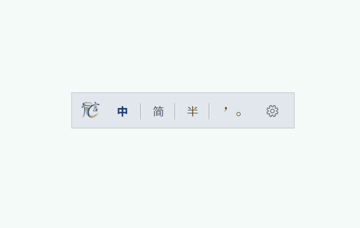

# Cassotis IME（言泉输入法）

<p align="center">
  
</p>

<p align="center">
  <a href="LICENSE"></a>
</p>

[English](README.md) | 简体中文

> **状态说明：** 项目仍处于非常早期阶段，暂不具备实际可用性；当前不提供预编译二进制文件。

Cassotis IME（言泉输入法）是一个面向 Windows 10/11 的实验性中文拼音输入法项目，主要使用 Delphi，并基于 TSF（Text Services Framework）实现。

<p align="center">
  
</p>

## 名称来源

英文名 **Cassotis** 源自 Delphi 神庙内的一眼圣泉。传说女祭司皮媞亚（Pythia）在发布神谕前会饮用此泉水以进入通灵状态——这眼泉被视为预言与灵感的真正源头，与从 Delphi 到人类语言的路径恰好呼应。

中文名**言泉**既契合 Cassotis 作为预言之泉的意象，也取"言如泉涌"之意，寄托了对流畅、智能输入体验的期许。

项目当前重点：

- 建立稳定的 TSF 输入法基础
- 保持模块化架构（TSF DLL + host 进程 + 工具链）
- 持续提升候选排序质量与常用词覆盖

## 当前状态

- TSF 文本服务主流程可用（注册、激活、组合生命周期）。
- TSF DLL 同时支持 Win64 与 Win32（`svr.dll` / `svr32.dll`），host 进程仅保留 Win64。
- 已实现候选窗、翻页、选词与上屏，候选窗支持 DPI 感知自绘。
- 已实现上下文同步（surrounding text）与按键状态同步。
- 基于动态规划的拼音音节切分，含歧义消解评分。
- 多维度候选排序：会话频次、bigram/trigram 上下文学习、分词路径偏好与惩罚、路径置信度分层。
- 用户学习持久化至 SQLite：提交统计、n-gram 上下文、查询路径偏好、候选惩罚。
- 简体/繁体基础词库分离，支持热切换无需重启。
- 候选窗锚点多源融合策略（TSF 坐标、GUI 消息、`GetCaretPos`、光标位置），对终端类宿主有专项处理。

## 架构

| 模块 | 路径 | 说明 |
|------|------|------|
| TSF COM 服务 | `src/tsf/` | 进程内文本服务，负责组合生命周期（Win64 + Win32）|
| 输入引擎 | `src/engine/` | 拼音解析、候选生成、排序与用户学习 |
| Host 进程 | `src/host/` | Win64 进程，通过 Named Pipe IPC 协调引擎与 UI |
| UI | `src/ui/` | 候选窗与托盘集成 |
| 公共工具 | `src/common/` | 配置、日志、IPC、SQLite 封装、共享类型 |
| 工具链 | `tools/` | 注册、运行时词库构建/导入/诊断等可执行程序 |

## 仓库结构

```
src/          源码
tools/        工具工程（注册、运行时词库构建、诊断）
data/         数据库 schema 与运行时词库导入样例数据
out/          编译产物与构建/管理脚本
third_party/  第三方依赖（SQLite 运行库）
```

## 关键二进制

所有二进制产物位于 `out/` 目录：

| 文件 | 说明 |
|------|------|
| `cassotis_ime_svr.dll` | Win64 TSF 进程内 COM 服务 |
| `cassotis_ime_svr32.dll` | Win32 TSF 进程内 COM 服务 |
| `cassotis_ime_host.exe` | Win64 host 进程 |
| `cassotis_ime_profile_reg.exe` | TSF profile/category 注册工具 |

TSF DLL 与 host 进程均须存在，输入法才能正常工作。

## 快速开始

前置要求：Windows 10/11、Delphi 10.4、以管理员身份打开的 PowerShell 终端。

在 `out/` 目录下依次执行：

```powershell
# 1. 编译所有二进制
.\rebuild_all.ps1

# 2. 向 Windows 注册 TSF（需管理员权限）
.\register_tsf.ps1

# 3. 构建运行时词库
.\rebuild_dict.ps1

# 4. 启动 TSF
.\start_tsf.ps1
```

完整的构建说明（包括增量更新、手动 IDE 构建、脚本参数及问题排查）请参阅 [BUILD.md](BUILD.md)。

## 词条资源与运行时词库

运行时词库构建流程会从同级词库源码仓导入生成词条资源（`..\cassotis-lexicon`）：

词库源码仓已单独发布在 [cassotis-lexicon](https://github.com/shenmin/cassotis-lexicon)。

- 词条输入文件：`dict_unihan_sc.txt`、`dict_unihan_tc.txt`、`dict_clean_sc.txt`、`dict_clean_tc.txt`
- 运行时词库文件：`out/data/dict_sc.db`（简体）、`out/data/dict_tc.db`（繁体）
- 用户词库：`out/data/user_dict.db`

## 配置

配置文件：`%LOCALAPPDATA%\CassotisIme\cassotis_ime.ini`（首次运行自动按默认值创建）。

详细配置项说明：[CONFIGURE.CN.md](CONFIGURE.CN.md)

重点配置项：

- 简/繁体词库切换（`dictionary.variant`）
- 初始输入模式、全角、标点风格
- 日志记录（路径、级别、轮转大小）

## 文档

- 构建说明：[BUILD.md](BUILD.md)
- 第三方组件说明：[THIRD_PARTY.md](THIRD_PARTY.md)

## 许可

本项目采用 GPL-3.0 许可证，完整文本见 [LICENSE](LICENSE)。

请确保第三方声明与 [THIRD_PARTY.md](THIRD_PARTY.md) 保持一致。

## 路线图

- 提升候选排序质量与常用词覆盖
- 强化用户词库质量控制与工具链
- 扩展编辑器/浏览器/IDE 兼容性
