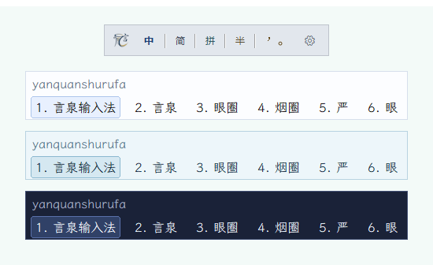

# Cassotis IME

<p align="center">
  
</p>

<p align="center">
  <a href="LICENSE"></a>
</p>
<p align="center">
  
</p>

English | [简体中文](README.zh-Hans.md) | [繁體中文](README.zh-Hant.md) | [Linux version](https://github.com/shenmin/cassotis-ime-linux)

Cassotis IME (言泉输入法) is an experimental Chinese Pinyin input method for Windows 10/11, built primarily with Delphi on top of TSF (Text Services Framework).

## Name Origin
The English name **Cassotis** comes from the sacred spring inside the Temple of Delphi. Before delivering oracles, the priestess Pythia was said to drink from this spring to enter a prophetic state. The spring was regarded as the true source of prophecy and inspiration, where oracles were born, which resonates with the path from Delphi to human language.

The Chinese name **言泉** (Yanquan, "Spring of Words") matches Cassotis as a prophetic spring, while also carrying the meaning of **言如泉涌** ("words flowing like a spring"), reflecting our expectation of a fluent and intelligent input experience.

The project focus is:
- build a stable TSF-based IME foundation,
- keep the architecture modular (TSF DLL + host process + tools),
- improve corpus-trained local ranking for long sentences and context-aware short-word selection.

## Features
- TSF text service pipeline is available (registration, activation, composition lifecycle), including the TSF COM-less capability category for hosts that use that activation path.
- TSF binaries support Win64 and Win32 (`svr.dll` / `svr32.dll`), while host process is Win64 only.
- Candidate paging, selection and text commitment are supported, with an optional expanded view showing up to three rows when paging. Number keys select from the active row; the Tab completion area is unchanged.
- Cassotis' original one-key completion displays exactly one trusted continuation and accepts it with the configured key. It prioritizes exact completion from the user and base dictionaries, then falls back to offline-vetted strong-transition completion. On long-sentence static misses, a constrained local model can review exact-lexicon suffix paths asynchronously and abstains when confidence is insufficient.
- Full Pinyin and six selectable Double Pinyin schemes—Microsoft, Xiaohe, Ziranma, Sogou, Ziguang, and Pinyin Jiajia—share the same candidate ranking and user-learning data.
- Configurable fuzzy Pinyin is supported for common initial and final pairs.
- Dictionary split is supported: simplified base DB, traditional base DB, and user DB.
- Base dictionary now includes `dict_jianpin` index entries for initial-letter abbreviations (for example `jt -> 今天`; retroflex variants like `zsjs/zhshjsh` are both generated).
- Full-path segmented phrase decoding is enabled (for example `womenjintian -> 我们今天`) while keeping prefix candidates for partial-commit fallback.
- Corpus-trained multi-stage long-sentence ranking guides path search, second-stage comparison, and final candidate selection without affecting short exact-query mode.
- An independent short-word context reranker uses already committed text to resolve ambiguous exact candidates while preserving normal no-context order.
- Surrounding-text/context synchronization and key state synchronization are implemented.

<p align="center">
  
  <br>
  <em>Three-row candidate view, with selection numbers on the active row.</em>
</p>

## Architecture
- `src/tsf`: TSF COM in-proc server (text service integration).
- `src/engine`: Pinyin parsing, candidate generation, ranking, and user learning.
- `src/host`: external host process for engine/UI orchestration.
- `src/ui`: candidate window and tray UI.
- `src/common`: config, logging, IPC, sqlite wrapper, shared utilities.
- `tools`: registration, dictionary build/import/diagnostics, helper executables.

## Repository Layout
- `src/` source code
- `tools/` utility projects and helper executables
- `data/` schema and sample dictionary import data
- `out/` scripts for build/register/rebuild/test
- `third_party/` vendored third-party binaries/sources (for example sqlite runtime package files)

## Key Binaries
- `cassotis_ime_svr.dll` (Win64 TSF in-proc COM server)
- `cassotis_ime_svr32.dll` (Win32 TSF in-proc COM server)
- `cassotis_ime_host.exe` (Win64 host process)
- `cassotis_ime_tray_host.exe` (Win64 tray/status host for tray menu, floating status window, and input-state indicator)
- `cassotis_ime_profile_reg.exe` (TSF profile/category registration utility)

Without TSF DLL + main host process, IME input will not work. Without the tray/status host, the core input path may still run, but the tray menu, floating status window, and state indicator will be unavailable.

## Build and Run (Quick Start)
Prerequisites:
- Windows 10/11
- Delphi 10.4
- SQLite runtime DLL (`sqlite3_64.dll`)

From `out/`:

```powershell
.\rebuild_all.ps1
.\cassotis_ime_profile_reg.exe register_tsf -dll_path .\cassotis_ime_svr.dll
.\rebuild_dict.ps1
```

For full build details, see `BUILD.md`.

## Dictionary Workflow
Current base dictionary pipeline imports generated lexicon artifacts from the [cassotis-lexicon](https://github.com/shenmin/cassotis-lexicon) project:
- lexicon inputs: `dict_unihan_sc.txt`, `dict_unihan_tc.txt`, `dict_clean_sc.txt`, `dict_clean_tc.txt`
- runtime DB files are rebuilt under `%LOCALAPPDATA%\CassotisIme\data\` (for example `dict_sc.db`, `dict_tc.db`)
- user dictionary defaults to `%LOCALAPPDATA%\CassotisIme\data\user_dict.db`
- `rebuild_dict.ps1` imports `pinyin<TAB>text<TAB>weight` and auto-builds `dict_jianpin` (including `z/c/s` and `zh/ch/sh` abbreviation variants)

Main rebuild entry:

```powershell
.\rebuild_dict.ps1
```

## Corpus-Trained Local Ranking
Cassotis v1.1.0 introduces an offline-trained local statistical language model for long-sentence path ranking. The training pipeline learns lexicon-constrained word bigram/trigram transition priors and a smoothed character trigram model from cleaned general Chinese and fiction corpora. The Benchmark-16300 corpus is kept separate and is not used for training.

Cassotis v1.3.0 adds the project's first deployable neural residual reranker. The compact feed-forward model is trained offline on lexicon-constrained N-best candidate comparisons and conservatively promotes better complete long-sentence candidates while retaining the original engine result as a fallback.

Cassotis v1.4.0 extends the same offline-training approach to short-word input. A separate context reranker combines character-LM evidence with the text immediately before the cursor when comparing exact candidates. It only participates when left context is available and the query has competing exact candidates; without usable context, the original short-word order is retained.

Cassotis v1.5.0 extends short-word context ranking into a two-stage local neural reranker. The first stage selects the exact candidate that best fits the preceding text, while an independently trained residual model conservatively corrects that result only when its score advantage clears a promotion threshold. Short-word input without context remains outside this model path.

Cassotis v1.6.0 advances long-sentence decoding into a corpus-trained multi-stage pipeline. A learned search-state ranker helps retain promising paths before pruning, a separate second-stage model compares surviving complete paths, and a final-candidate ranker with a learned fallback policy changes the original order only when the evidence is sufficiently reliable. These models are trained offline from lexicon-constrained candidate comparisons rather than benchmark-specific sentence rules.

Cassotis v1.7.0 refines short-input phrase composition. Four-syllable inputs can combine two complete dictionary phrases when corpus-trained transition evidence is strong, while unsupported combinations remain excluded. Phrase prefixes and first-syllable character choices stay visible, and after a partial selection the remaining single-character candidates use the already selected text as contextual ranking evidence.

Cassotis v1.8.0 strengthens learned ranking on both paths. Long-sentence decoding adds pairwise, local-difference, and visible-candidate residual checks around the existing multi-stage ranker, improving choices among complete candidates without changing lexicon-constrained generation. Short-word input adds a separately trained no-context residual ranker; conservative confidence calibration preserves strong exact candidates when model evidence is weak.

Cassotis v1.9.0 upgrades long-sentence recall and ranking with a unified, corpus-trained complete-candidate pool. It retains structurally diverse, lexicon-constrained complete paths and ranks them with language-model, N-best consensus, and residual signals under confidence and latency controls.

Cassotis v1.10.0 extends corpus-trained transition evidence to controlled 1+2 and 2+1 exact-word combinations for three-syllable input, while adding a conservative pairwise review of the leading complete long-sentence candidates. Both paths change results only when the learned evidence is sufficiently strong.

Cassotis v1.11.0 broadens corpus-trained word-transition coverage, improving short-phrase composition and long-sentence path selection when LM evidence is strong.

Cassotis v1.12.0 extends this evidence to tightly gated 1+1 single-character combinations absent from the lexicon. Only common readings with multi-source corpus support are retained, dictionary exact matches remain ahead, and the same signal only breaks close ties in long-sentence ranking.

Cassotis v1.13.0 adds bidirectional exact-word-anchored recovery for long sentences and difference-aware short-context reranking. Forward/reverse LM evidence, 8-12 characters of preceding text, and strict confidence gates are used to adjust only genuinely competing candidates.

Cassotis v1.14.0 expands exact-word-anchored recovery into a controlled complete-path pool and strengthens difference-aware short-context ranking and LM-backed phrase continuation. Complete paths from different recovery channels are compared conservatively by the unified local ranker using corpus-trained evidence.

Cassotis v1.15.0 consolidates long-sentence Top1/Top2 decisions in a corpus-trained final arbiter and expands evidence for short-word context reranking, changing order only when the learned advantage is clear.

Cassotis v1.18.0 adds a constrained neural fallback for long-sentence local continuation. The 13.82M-parameter ranker compares at most 32 suffix paths composed only of exact lexicon words, and either returns one to three words within six syllables or abstains. Existing static completion remains the zero-cost first tier; only misses are queued to a background CPU worker in `cassotis_ime_host.exe`, and stale or low-confidence results are discarded.

Cassotis v1.19.0 deploys a Pinyin-conditioned sequence scorer in the final long-sentence decision stage: the external host jointly compares the complete Pinyin input with up to 16 stable candidates, while offline-trained gate and fusion models decide whether to reorder them. Long-sentence one-key completion also expands its multi-level suffix-recall index, using a native recall selector to filter exact-lexicon continuations before the existing completion model reviews them.

Cassotis v1.20.0 adds document-local adaptation and constrained generation to the existing ranking pipeline. A cached snapshot of text before the cursor supplies temporary term and transition evidence, while quantized generators add Pinyin-aligned complete candidates and local long-sentence continuations that static recall misses; low-confidence or unavailable model results are discarded.

Cassotis v1.22.0 introduces Pinyin-constrained local correction with cross-sentence context. A local model distilled from a Chinese pretrained teacher uses the current draft, original Pinyin, and up to 256 available preceding characters to conservatively repair small homophone errors in simplified-Chinese full-Pinyin long sentences, rather than only rearranging existing candidates; user words, full-query dictionary exact matches, and confirmed text remain protected.

Cassotis v1.26.0 extends local correction for long sentences from per-character decisions to joint selection among a small set of complete corrections. To reduce harmful edits, models trained on independent corpora compare the edited spans in context and recheck proposed corrections against the existing result, keeping that result when evidence is insufficient.

Cassotis v1.30.0 adds a shared character-level autoregressive language model trained on independent Chinese corpora to select complete long-sentence candidates, context-sensitive short words, and long-sentence Tab continuations. The former RBT3 short-word context model has been removed; the new model combines sentence coherence and preceding context with the existing ranking and protections to improve homophone selection and continuation quality.

Cassotis v1.31.0 upgrades the shared character language model and trains dedicated Tab selection policies on real engine candidates from independent corpora, comparing ways to finish the current word and continue with subsequent phrases. Short-input Tab candidates are reranked with preceding context in the background, while Pinyin syllable boundaries and user completion preferences remain protected.

To keep the deeper ranking pipeline responsive, search, second-stage ranking, residual comparison, and final selection reuse character-LM scores, exact dictionary lookups, path features, and context features. Expensive consensus and lookup work uses shared caches and explicit time budgets to limit long-tail latency. Exact and prefix candidate visibility remains protected, while repeated work across ranking stages is avoided.

Statistical priors are quantized into the local dictionary database, while most compact rerankers are exported as deterministic native Pascal parameters. The v1.30.0 shared character language model and a Pinyin-conditioned language model fine-tuned from it are deployed as quantized ONNX models. The shared language model has taken over long-sentence continuation from the v1.18.0 continuation fallback and the v1.20.0 continuation generator, and complete-candidate reranking from the v1.19.0 Pinyin-conditioned scorer; the Pinyin-conditioned model rewrites the settled long-sentence result against the typed syllables, taking over from the v1.20.0 constrained candidate generator and the v1.22.0 and v1.26.0 local correction models. The replaced models are no longer shipped; ONNX Runtime is loaded only by the external host process, never by the TSF DLL. Runtime scoring remains local and bounded, requires no network or GPU, and falls back to the existing result while a model is loading or unavailable. Long-sentence and short-word ranking remain separate paths, so improvements to one do not replace the other's matching rules.

## Long Sentence Benchmark-16300
See [BENCHMARK.md](BENCHMARK.md) for the Benchmark-16300 methodology, corpus source, and scoring rules.

Corpus: 16,300 eligible Chinese sentences from the developer's own novel [**Elegance in Timelessness**](https://www.qidian.com/book/1037259117/) (Chinese title: [**永恒的舞动**](https://www.qidian.com/book/1037259117/)).

| Version | Top1 | Top2 | Mean (ms) | P50 (ms) | P95 (ms) | Max (ms) |
|---|---:|---:|---:|---:|---:|---:|
| `v1.31.0` | 12940/16300 (79.39%) | 13534/16300 (83.03%) | 61.29 | 62 | 94 | 282 |
| `v1.30.0` | 12828/16300 (78.70%) | 13514/16300 (82.91%) | 55.25 | 47 | 94 | 266 |
| `v1.29.0` | 11997/16300 (73.60%) | 12970/16300 (79.57%) | 39.89 | 32 | 63 | 234 |
| `v1.28.0` | 11987/16300 (73.54%) | 12964/16300 (79.53%) | 63.72 | 62 | 109 | 484 |
| `v1.27.0` | 11978/16300 (73.48%) | 12955/16300 (79.48%) | 63.08 | 62 | 109 | 468 |
| `v1.26.0` | 11974/16300 (73.46%) | 12947/16300 (79.43%) | 62.83 | 62 | 109 | 453 |
| `v1.25.0` | 11698/16300 (71.77%) | 12830/16300 (78.71%) | 57.49 | 47 | 94 | 438 |
| `v1.24.0`<br/>`v1.23.0` | 11679/16300 (71.65%) | 12813/16300 (78.61%) | 57.09 | 47 | 94 | 438 |
| `v1.22.0` | 11672/16300 (71.61%) | 12809/16300 (78.58%) | 55.17 | 47 | 94 | 407 |
| `v1.21.1` | 11080/16300 (67.98%) | 12395/16300 (76.04%) | 59.33 | 62 | 109 | 407 |
| `v1.20.0` | 11065/16300 (67.88%) | 12376/16300 (75.93%) | 59.53 | 47 | 110 | 406 |
| `v1.19.0` | 10917/16300 (66.98%) | 12248/16300 (75.14%) | 55.99 | 47 | 94 | 437 |
| `v1.18.0` | 10731/16300 (65.83%) | 12128/16300 (74.40%) | 51.78 | 47 | 93 | 454 |
| `v1.17.0` | 10595/16300 (65.00%) | 12023/16300 (73.76%) | 42.68 | 32 | 78 | 406 |
| `v1.16.0` / `v1.15.0` | 10553/16300 (64.74%) | 11921/16300 (73.13%) | 41.5 | 32 | 78 | 484 |
| `v1.14.0` | 10345/16300 (63.47%) | 11903/16300 (73.02%) | 58.78 | 47 | 172 | 766 |
| `v1.13.0` | 10131/16300 (62.15%) | 11320/16300 (69.45%) | 65.94 | 47 | 203 | 1047 |
| `v1.12.0` | 9767/16300 (59.92%) | 10996/16300 (67.46%) | 63.03 | 47 | 187 | 1062 |
| `v1.11.0` | 9760/16300 (59.88%)<br>*9340/16300 (57.30%)* | 10990/16300 (67.42%)<br>*10773/16300 (66.09%)* | 59.82 | 47 | 187 | 1031 |
| `v1.10.0` | 9279/16300 (56.93%) | 10708/16300 (65.69%) | 60.39 | 47 | 188 | 1046 |
| `v1.9.0` | 9121/16300 (55.96%) | 10685/16300 (65.55%) | 59.65 | 47 | 187 | 1172 |
| `v1.8.1` | 8285/16300 (50.83%) | 9067/16300 (55.63%) | 72.44 | 47 | 281 | 1594 |
| `v1.7.0` | 7940/16300 (48.71%) | 8642/16300 (53.02%) | 71.55 | 47 | 235 | 2047 |
| `v1.6.0` | 7936/16300 (48.69%) | 8637/16300 (52.99%) | 66.99 | 32 | 219 | 1687 |
| `v1.5.0` | 7459/16300 (45.76%) | 7966/16300 (48.87%) | 63.42 | 46 | 203 | 2140 |
| `v1.4.0` | 7168/16300 (43.98%) | 7617/16300 (46.73%) | 66.23 | 46 | 218 | 2578 |
| `v1.3.0` | 7155/16300 (43.90%) | 7601/16300 (46.63%) | 64.54 | 46 | 203 | 2188 |
| `v1.2.0` | 6895/16300 (42.30%) | 7303/16300 (44.80%) | 59.89 | 32 | 188 | 2078 |
| `v1.1.0` | 6677/16300 (40.96%) | 7067/16300 (43.36%) | 73.18 | 47 | 234 | 2750 |
| `v1.0.0` | 6106/16300 (37.46%) | 6857/16300 (42.07%) | 71.49 | 47 | 219 | 5344 |
| `v0.8.5` | 6097/16300 (37.40%) | 6847/16300 (42.01%) | 520.05 | 406 | 1203 | 13297 |
| `v0.7.0` | 5368/16300 (32.93%) | 6110/16300 (37.48%) | — | — | — | — |
| `v0.6.0` | 4905/16300 (30.09%) | 5378/16300 (32.99%) | — | — | — | — |
| `v0.5.0` | 4834/16300 (29.66%) | 5243/16300 (32.17%) | — | — | — | — |
| `v0.4.0` | 4371/16300 (26.82%) | 4744/16300 (29.10%) | — | — | — | — |
| `v0.3.1` | 3845/16300 (23.59%) | 4651/16300 (28.53%) | — | — | — | — |
| `v0.2.0` | 2671/16300 (16.39%) | 2863/16300 (17.56%) | — | — | — | — |

`v1.12.0` uses the new scoring rule that treats `他` and `她` as equivalent at the same character positions. For `v1.11.0`, regular values use this rule, while italic values use the previous strict rule that distinguishes them. `v1.10.0` and earlier releases use the strict rule; releases from `v1.12.0` onward publish only the new-rule results.

Latency values are engine-only full-query decode times. Each complete Pinyin query is assigned at once, so these values do not represent incremental keystroke-to-display latency. `—` means that the version was not measured under this latency protocol. See [BENCHMARK.md](BENCHMARK.md) for the complete methodology.

## Short-word Context Benchmark-65000
This benchmark contains 65,000 occurrences of two- to four-character words, each paired with the sentence prefix already committed before that word. Its cases use the same novel text as Benchmark-16300 as their source and are excluded from short-context model training. User-dictionary ranking is disabled during evaluation.

See [BENCHMARK.md](BENCHMARK.md) for the shared corpus source, short-word case construction, scoring rules, and latency protocol.

`Contested` is the subset where the same Pinyin query maps to at least two expected words in the corpus, making left context materially useful. The table reports the context-enabled benchmark.

| Version | Top1 | Top2 | Contested Top1 | Contested Top2 | Mean (ms) | P50 (ms) | P95 (ms) | Max (ms) |
|---|---:|---:|---:|---:|---:|---:|---:|---:|
| `v1.31.0` | 63036/65000 (96.98%) | 64104/65000 (98.62%) | 10491/11728 (89.45%) | 11196/11728 (95.46%) | 4.582 | 3.262 | 10.352 | 22.327 |
| `v1.30.0` | 62926/65000 (96.81%) | 64073/65000 (98.57%) | 10449/11728 (89.09%) | 11169/11728 (95.23%) | 3.525 | 3.192 | 7.660 | 21.122 |
| `v1.29.0` | 61971/65000 (95.34%) | 63568/65000 (97.80%) | 9675/11728 (82.49%) | 10776/11728 (91.88%) | 2.999 | 2.198 | 7.316 | 27.596 |
| `v1.28.0` | 61860/65000 (95.17%) | 63562/65000 (97.79%) | 9596/11728 (81.82%) | 10775/11728 (91.87%) | 4.453 | 3.908 | 9.214 | 34.468 |
| `v1.27.0`<br/>`v1.26.0` | 61860/65000 (95.17%) | 63549/65000 (97.77%) | 9596/11728 (81.82%) | 10775/11728 (91.87%) | 4.474 | 3.908 | 9.310 | 35.645 |
| `v1.25.0` | 61859/65000 (95.17%) | 63549/65000 (97.77%) | 9596/11728 (81.82%) | 10775/11728 (91.87%) | 4.705 | 4.103 | 9.817 | 40.027 |
| `v1.18.0` - `v1.24.0` | 61827/65000 (95.12%) | 63517/65000 (97.72%) | 9596/11728 (81.82%) | 10775/11728 (91.87%) | 4.584 | 3.985 | 9.653 | 39.36 |
| `v1.15.0` - `v1.17.0` | 61827/65000 (95.12%) | 63516/65000 (97.72%) | 9596/11728 (81.82%) | 10775/11728 (91.87%) | 3.817 | 3.239 | 8.376 | 39.881 |
| `v1.14.0` | 61782/65000 (95.05%) | 63516/65000 (97.72%) | 9560/11728 (81.51%) | 10775/11728 (91.87%) | 3.998 | 3.132 | 8.665 | 68.147 |
| `v1.13.0` | 61515/65000 (94.64%) | 63516/65000 (97.72%) | 9384/11728 (80.01%) | 10775/11728 (91.87%) | 4.748 | 3.652 | 10.337 | 103.689 |
| `v1.12.0` | 61343/65000 (94.37%) | 63474/65000 (97.65%) | 9304/11728 (79.33%) | 10745/11728 (91.62%) | 4.400 | 3.417 | 9.462 | 104.316 |
| `v1.11.0` | 61343/65000 (94.37%)<br>*61227/65000 (94.20%)* | 63474/65000 (97.65%)<br>*63461/65000 (97.63%)* | 9304/11728 (79.33%)<br>*9191/11728 (78.37%)* | 10745/11728 (91.62%)<br>*10732/11728 (91.51%)* | 4.217 | 3.284 | 9.110 | 75.503 |
| `v1.10.0` | 61214/65000 (94.18%) | 63448/65000 (97.61%) | 9191/11728 (78.37%) | 10732/11728 (91.51%) | 4.425 | 3.446 | 9.591 | 84.68 |
| `v1.9.0` | 61215/65000 (94.18%) | 63448/65000 (97.61%) | 9191/11728 (78.37%) | 10732/11728 (91.51%) | 4.214 | 3.268 | 9.113 | 71.004 |
| `v1.8.1` | 61206/65000 (94.16%) | 63430/65000 (97.58%) | 9182/11728 (78.29%) | 10725/11728 (91.45%) | 4.85 | 3.721 | 10.413 | 107.714 |
| `v1.7.0` | 61053/65000 (93.93%) | 63424/65000 (97.58%) | 9154/11728 (78.05%) | 10723/11728 (91.43%) | 4.668 | 3.468 | 10.013 | 158.471 |
| `v1.6.0` | 61043/65000 (93.91%) | 63414/65000 (97.56%) | 9154/11728 (78.05%) | 10723/11728 (91.43%) | 4.455 | 3.295 | 9.580 | 160.817 |
| `v1.5.0` | 61045/65000 (93.92%) | 63364/65000 (97.48%) | 9159/11728 (78.10%) | 10677/11728 (91.04%) | 5.033 | 4.113 | 9.968 | 142.372 |
| `v1.4.0` | 60676/65000 (93.35%) | 63251/65000 (97.31%) | 8993/11728 (76.68%) | 10602/11728 (90.40%) | 5.573 | 4.521 | 11.157 | 158.687 |
| `v1.3.0` | 59078/65000 (90.89%) | 62881/65000 (96.74%) | 8326/11728 (70.99%) | 10386/11728 (88.56%) | 5.460 | 4.396 | 10.939 | 176.912 |

`v1.12.0` uses the new scoring rule that treats `他` and `她` as equivalent at the same character positions. For `v1.11.0`, regular values use this rule, while italic values use the previous strict rule that distinguishes them. `v1.10.0` and earlier releases use the strict rule; releases from `v1.12.0` onward publish only the new-rule results.

Latency values are engine-only per-query times for the context-enabled track and do not include TSF or candidate-window rendering.

## One-key Completion Context Benchmark-12831
This benchmark reuses the frozen short-word context corpus and expands eligible targets into 12,831 incremental Pinyin-prefix opportunities. It evaluates the single completion actually shown when left context is enabled.

Public results retain five columns: `Completion Hit`, `Avg Keys Saved`, `Stability`, `Keystroke P95 (ms)`, and `Final P95 (ms)`; the two latencies differ only from `v1.31.0`, when an asynchronous language-model rerank was added. Results are recorded from `v1.15.0`; see [BENCHMARK.md](BENCHMARK.md) for case construction, scoring, and latency details.

| Version | Completion Hit | Avg Keys Saved | Stability | Keystroke P95 (ms) | Final P95 (ms) |
| --- | --- | --- | --- | --- | --- |
| `v1.31.0` | 10336/12831 (80.55%) | 2.638 | 2123/2185 (97.16%) | 1.238 | 11.881 |
| `v1.30.0`<br/>`v1.29.0` | 9420/12831 (73.42%) | 2.548 | 1691/1749 (96.68%) | 0.968 | 0.968 |
| `v1.18.0` - `v1.28.0` | 9419/12831 (73.41%) | 2.549 | 1691/1749 (96.68%) | 2.026 | 2.026 |
| `v1.17.0` | 9273/12831 (72.27%) | 2.554 | 1652/1718 (96.16%) | 1.880 | 1.880 |
| `v1.16.0` | 8752/12831 (68.21%) | 2.570 | 1649/1676 (98.39%) | 1.509 | 1.509 |
| `v1.15.0` | 7265/12831 (56.62%) | 2.542 | 1278/1323 (96.60%) | 0.777 | 0.777 |

## Long-sentence One-key Completion Benchmark-16300
This benchmark leaves the final four complete Pinyin syllables untyped and evaluates the single completion actually shown. A hit must correctly extend the intended prefix while remaining a prefix of the reference sentence; it need not complete the entire sentence in one step. See [BENCHMARK.md](BENCHMARK.md) for the full protocol.

### Current local-continuation protocol

| Version | Local Completion Hit | Predictive Prompt Coverage | Total Keys Saved | P95 (ms) |
| --- | --- | --- | --- | --- |
| `v1.31.0` | 3513/16300 (21.55%) | 15815/16300 (97.02%) | 7478 | 116.682 |
| `v1.30.0` | 855/16300 (5.25%) | 7203/16300 (44.19%) | 1822 | 77.819 |
| `v1.29.0` | 449/16300 (2.75%)<br>*424/16300 (2.60%)* | 6778/16300 (41.58%) | 1023<br>*987* | 53.085 |
| `v1.28.0` | 426/16300 (2.61%) | 6776/16300 (41.57%) | 989 | 78.689 |
| `v1.27.0` | 425/16300 (2.61%) | 6769/16300 (41.53%) | 987 | 80.099 |
| `v1.26.0` | 410/16300 (2.52%) | 6488/16300 (39.80%) | 967 | 80.437 |
| `v1.25.0` | 409/16300 (2.51%) | 6489/16300 (39.81%) | 959 | 74.936 |
| `v1.22.0` - `v1.24.0` | 407/16300 (2.50%) | 6474/16300 (39.72%) | 953 | 77.103 |
| `v1.21.1`<br/>`v1.20.0` | 357/16300 (2.19%) | 6475/16300 (39.72%) | 861 | 118.064 |
| `v1.19.0` | 202/16300 (1.24%) | 3834/16300 (23.52%) | 571 | 92.453 |
| `v1.18.0` | 143/16300 (0.88%) | 3957/16300 (24.28%) | 478 | 109.060 |

From `v1.30.0`, this benchmark treats `他` and `她` as equivalent at the same character positions. For `v1.29.0`, regular values are rescored from the saved results using this rule, while italic values retain the previous strict rule. Predictive prompt coverage and latency are unchanged. `v1.28.0` and earlier releases use the strict rule; releases from `v1.30.0` onward publish only the new-rule results.

`Predictive Prompt Coverage` counts opportunities where a predictive completion was displayed; exact-word joins that only convert already typed Pinyin are excluded. `Total Keys Saved` sums the net keys saved by correct local-continuation hits after charging one key for accepting each completion. Per-hit averages and incremental stability remain available in detailed diagnostic reports rather than the public comparison table.

### Historical whole-sentence protocol

| Version | Whole-sentence Hit | Total Keys Saved | P95 (ms) |
| --- | --- | --- | --- |
| `v1.17.0` | 20/16300 (0.12%) | 124 | 55.049 |
| `v1.16.0` | 10/16300 (0.06%) | 71 | 65.063 |

`v1.16.0` and `v1.17.0` use the legacy strict whole-sentence criterion and are retained only as historical results. They are not directly comparable with the current local-continuation protocol.

## Configuration
Default config file:
- `%LOCALAPPDATA%\CassotisIme\cassotis_ime.ini`

Important options include:
- Pinyin scheme (Full Pinyin / Microsoft Double Pinyin / Xiaohe Double Pinyin / Ziranma Double Pinyin / Sogou Double Pinyin / Ziguang Double Pinyin / Pinyin Jiajia)
- simplified/traditional variant switching (`variant`)
- full-width / punctuation mode
- debug logging and log path

Runtime dictionary paths are fixed under `%LOCALAPPDATA%\CassotisIme\data\` and are no longer configured through the INI file.

## Documentation
- Simplified Chinese documentation: [README.zh-Hans.md](README.zh-Hans.md)
- Traditional Chinese documentation: [README.zh-Hant.md](README.zh-Hant.md)
- Configuration reference: `CONFIGURE.md`
- Build details: `BUILD.md`
- Third-party notices: `THIRD_PARTY.md`

## License
This project is licensed under GPL-3.0. See `LICENSE` for the full license text.

Keep third-party notices and attribution files consistent with `THIRD_PARTY.md`.

## Roadmap
- continue training compact local rerankers from independent corpora and N-best comparisons
- expand independent benchmarks and failure attribution to tune model gates and fallback behavior
- improve user-dictionary quality control and tooling
- extend compatibility matrix across editors/browsers/IDEs
